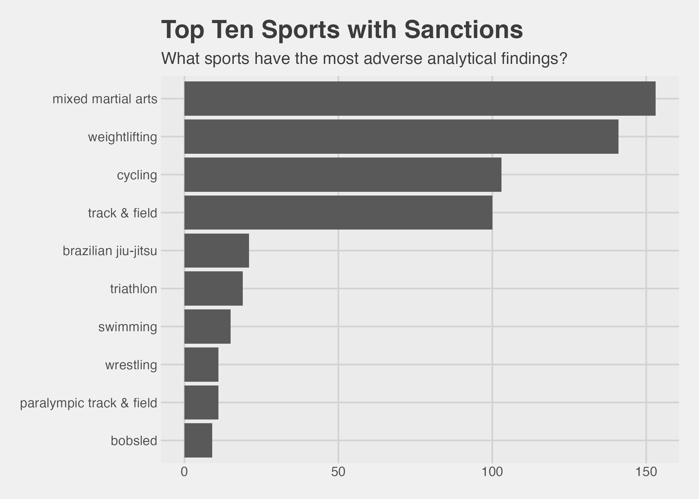
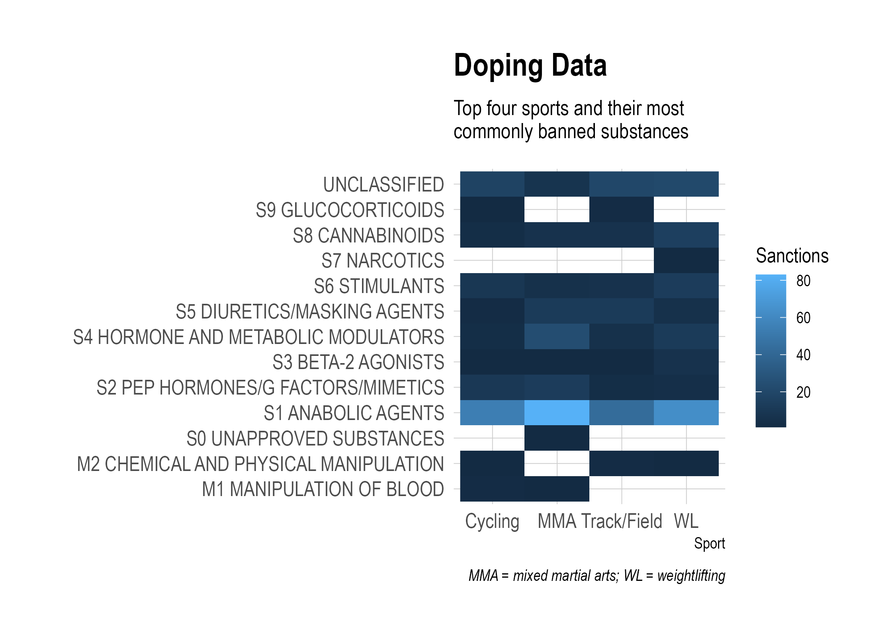
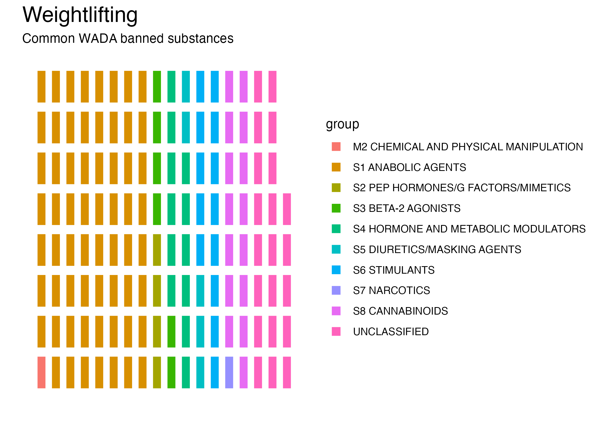

<!-- README.md is generated from README.Rmd. Please edit that file -->

# dopingdata

<!-- badges: start -->

<figure>

<figcaption aria-hidden="true">Lifecycle: experimental</figcaption>
</figure>

<!-- https://img.shields.io/badge/lifecycle-stable-green.svg -->

<!-- badges: end -->

`dopingdata` contains data from the [United States Anti-Doping
Agency](https://en.wikipedia.org/wiki/United_States_Anti-Doping_Agency)
for exploration, modeling, and visualizations. The datasets in this
package are derived from from the [USADA
website](https://www.usada.org/) and the [World Anti-Doping Agency
(WADA) banned substances
list](https://www.wada-ama.org/en/prohibited-list?q=). Scraping,
processing, and visualizing these data presented so many unique
challenges I decided to combine the utilities into a package.

## Installation

You can install the development version of `dopingdata` like so:

``` r
# install.packages("pak")
pak::pak("mjfrigaard/dopingdata")
```

``` r
library(dopingdata)
#> 
#> Attaching package: 'dopingdata'
#> The following object is masked _by_ '.GlobalEnv':
#> 
#>     %nin%
```

<figure>

<figcaption aria-hidden="true">Bar chart of the top ten sports with the
most USADA sanctions</figcaption>
</figure>

<figure>

<figcaption aria-hidden="true">Heatmap of WADA substance categories by
sport, for the four most-sanctioned sports</figcaption>
</figure>

<figure>

<figcaption aria-hidden="true">Waffle chart of common WADA banned
substances in weightlifting sanctions</figcaption>
</figure>
