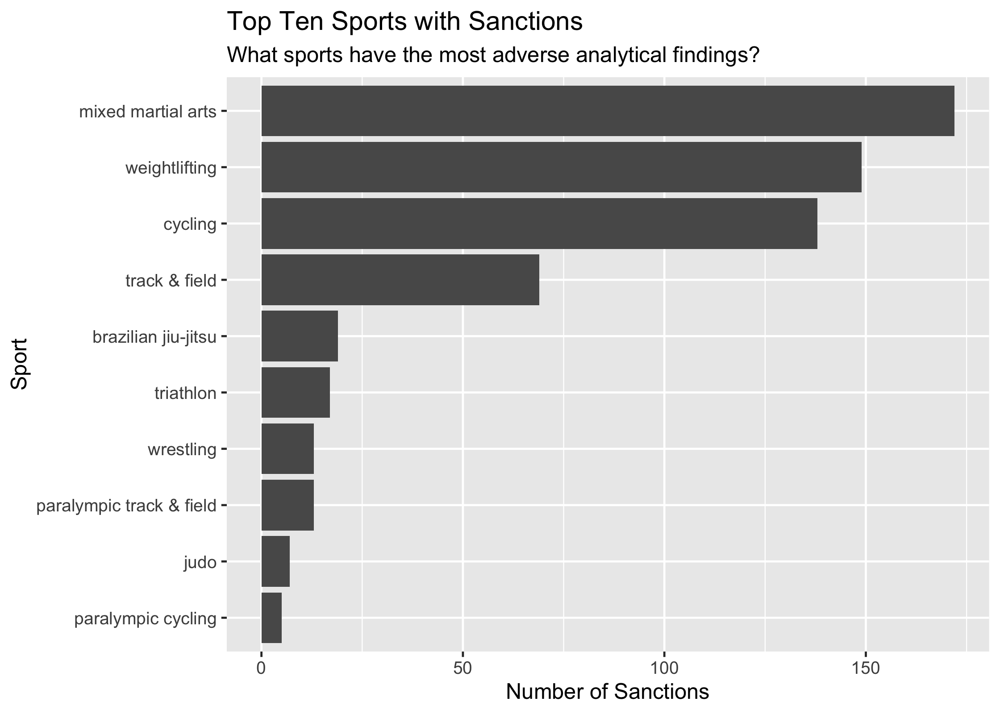

<!-- README.md is generated from README.Rmd. Please edit that file -->

# dopingdata

<!-- badges: start -->


<!-- https://img.shields.io/badge/lifecycle-stable-green.svg -->
<!-- badges: end -->

`dopingdata` contains data from the [United States Anti-Doping
Agency](https://en.wikipedia.org/wiki/United_States_Anti-Doping_Agency)
for exploration, modeling, and visualizations. The datasets in this
package are derived from from the [USADA
website](https://www.usada.org/) and the [World Anti-Doping Agency
(WADA) banned substances
list](https://www.wada-ama.org/en/prohibited-list?q=). Scraping,
processing, and visualizing these data presented so many unique
challenges I decided to combine the utilities into a package.

## Installation

You can install the development version of `dopingdata` like so:

``` r
# install.packages("devtools")
devtools::install_github("mjfrigaard/dopingdata")
```

``` r
library(dopingdata)
```

## Scraping USADA Data

Each dataset was ha**rvest**ed using the
[`rvest`](https://rvest.tidyverse.org/) and
[`xml2`](https://xml2.r-lib.org/) packages, but using manners (with the
[`polite`](https://dmi3kno.github.io/polite/) package).

``` r
scrape_sanctions(dest_path = "data-raw/csv")
```

    Exporting data: data-raw/csv/2023-12-20/2023-12-20-usada_raw.csv
    Data successfully exported!

`dopingdata` results in a lot of datasets, so I’ve written two helper
functions (and an example raw dataset to demonstrate).

``` r
str(example_usada_raw)
#> 'data.frame':    250 obs. of  5 variables:
#>  $ Athlete           : chr  "*Name Removed" "Richardson, Sha'Carri" "*Name Removed" "*Name Removed" ...
#>  $ Sport             : chr  "Cycling" "Track and Field" "Track and Field" "Bobsled and Skeleton" ...
#>  $ Substance.Reason  : chr  "Non-Analytical: Use and Possession (EPO)" "Cannabinoids" "Non-Analytical: Refusal to Submit to Sample Collection" "Elevated T/E" ...
#>  $ Sanction.Terms    : chr  "2-Year Suspension - Loss of Results" "1-Month Suspension; Loss of Results" "2-Year Suspension - Loss of Results" "2-Year Suspension - Loss of Results" ...
#>  $ Sanction.Announced: chr  "" "07/02/2021" "" "" ...
```

### **export_data()**

`export_data()` will export data of various `type`s (`.csv`, `.tsv`,
`.rds`, etc.) to a designated `path`:

``` r
export_data(x = example_usada_raw, path = "dev", type = "rds")
#> Exporting data: dev/2023-12-21/2023-12-21-example_usada_raw.rds
#> Data successfully exported!
```

### **export_extdata()**

`export_extdata()` is similiar, but exports the data to an `inst/`
folder (helpful when writing R packages).

``` r
export_extdata(x = example_usada_raw, path = "raw", type = "csv")
#> Exporting data: inst/extdata/raw/2023-12-21/2023-12-21-example_usada_raw.csv
#> Data successfully exported!
```

### **process_text()**

`process_text()` performs the following:

- Processed data have all had the column names formatted `snake_case`

- All of the text has been converted to lowercase

Below we’ll import the scraped data in `data-raw/csv/` and process the
text:

    #> 'data.frame':    937 obs. of  5 variables:
    #>  $ athlete           : chr  "rodriguez, daniel" "park, mariah" "frey, john" "jha, kanak" ...
    #>  $ sport             : chr  "mixed martial arts" "weightlifting" "cycling" "table tennis" ...
    #>  $ substance_reason  : chr  "ostarine; lgd-4033" "chlorthalidone" "non-analytical: refusal to submit to sample collection" "non-analytical: 3 whereabouts failures" ...
    #>  $ sanction_terms    : chr  "3-month suspenion" "public warning" "2-year suspension; loss of results" "1-year suspension; loss of results" ...
    #>  $ sanction_announced: chr  "12/14/2023" "12/11/2023" "12/05/2023" "original: 3/20/2023; updated: 12/01/2023" ...

## Dates

`sanction_announced` contains the date the sanction was announced, and
about 30 of these contain two values (`original` and `updated`).
Wrangling these values pose some challenges because they aren’t
*consistently* messy:

``` r
subset(usada, 
  grepl("^original", usada[['sanction_announced']]), 
  c(athlete, sanction_announced))
```

<div class="kable-table">

|     | athlete                | sanction_announced                        |
|:----|:-----------------------|:------------------------------------------|
| 4   | jha, kanak             | original: 3/20/2023; updated: 12/01/2023  |
| 88  | prempeh, ernest        | original: 05/07/2019; updated: 02/04/2022 |
| 91  | ngetich, eliud         | original: 09/03/21; updated: 01/25/22     |
| 121 | gehm, zach             | original: 11/04/2019;updated: 05/17/2021  |
| 152 | hudson, ryan           | original 12/20/2018; updated 11/04/2020   |
| 156 | paparella, flavia      | original: 10/19/2020updated: 01/05/2021   |
| 167 | murdock, vince         | original: 09/05/2019; updated: 08/26/2020 |
| 171 | rante, danielle        | original: 07/22/2020, updated: 11/03/2022 |
| 200 | werdum, fabricio       | original 09/11/2018; updated 01/16/2020   |
| 212 | jones, stirley         | original: 06/17/2019; updated: 12/16/2019 |
| 213 | hay, amy               | original: 10/31/2017; updated: 12/16/2019 |
| 240 | orbon, joane           | original: 08/12/2019; updated: 09/10/2019 |
| 255 | ribas, amanda          | original: 01/10/2018; updated 05/03/2019  |
| 288 | saccente, nicholas     | original: 02/14/2017; updated: 12/11/2018 |
| 289 | miyao, paulo           | original: 05/10/2017;updated: 11/27/2018  |
| 293 | garcia del moral, luis | original: 07/10/2012;updated: 10/26/2018  |
| 294 | bruyneel, johan        | original: 04/22/2014;updated: 10/24/2018  |
| 295 | celaya lazama, pedro   | original: 04/22/2014;updated: 10/24/2018  |
| 296 | marti, jose            | original: 04/22/2014;updated: 10/24/2018  |
| 297 | moffett, shaun         | original: 04/24/2018updated: 10/19/2018   |
| 305 | hunter, adam           | original: 10/28/2016; updated: 09/26/2018 |
| 384 | bailey, ryan           | original: 08/03/2017; updated: 12/01/2017 |
| 450 | thomas, tammy          | original: 08/30/2002; updated: 02/13/2017 |
| 478 | tovar, oscar           | original: 10/28/2015; updated: 10/04/2016 |
| 518 | fischbach, dylan       | original: 12/18/2015; updated: 04/11/2016 |
| 526 | lea, robert            | original: 12/17/2015; updated: 02/25/2016 |
| 539 | trafeh, mohamed        | original: 12/18/2014; updated: 08/25/2015 |
| 604 | dotti, juan pablo      | original: 10/20/2011; updated: 06/05/2013 |
| 679 | oliveira, flavia       | original: 04/13/2010; updated 12/10/2010  |
| 742 | young, jerome          | original: 11/10/2004; updated: 06/17/2008 |

</div>

### **clean_dates()**

I’ve written a `clean_dates()` function that takes `date_col`, `split`
and `pattern` arguments:

- `df` = processed USADA dataset with messy dates

- `date_col` = sanction date column (usually `sanction_announced`)

- `split` = regex to pass to split argument of `strsplit()` (defaults to
  `"updated"`)

- `pattern` = regex for other non-date pattern (defaults to
  `"original"`)

Below is an example dataset to demonstrate how `clean_dates()` works:

``` r
clean_dates(
  df = example_sanction_dates, 
  date_col = "ugly_dates", 
  split = "updated", 
  pattern = "original")
```

<div class="kable-table">

| athlete                | ugly_dates                                | pattern_date | split_date |
|:-----------------------|:------------------------------------------|:-------------|:-----------|
| jha, kanak             | original: 3/20/2023; updated: 12/01/2023  | 2023-03-20   | 2023-12-01 |
| prempeh, ernest        | original: 05/07/2019; updated: 02/04/2022 | 2019-05-07   | 2022-02-04 |
| ngetich, eliud         | original: 09/03/21; updated: 01/25/22     | 0021-09-03   | 0022-01-25 |
| gehm, zach             | original: 11/04/2019;updated: 05/17/2021  | 2019-11-04   | 2021-05-17 |
| hudson, ryan           | original 12/20/2018; updated 11/04/2020   | 2018-12-20   | 2020-11-04 |
| paparella, flavia      | original: 10/19/2020updated: 01/05/2021   | 2020-10-19   | 2021-01-05 |
| murdock, vince         | original: 09/05/2019; updated: 08/26/2020 | 2019-09-05   | 2020-08-26 |
| rante, danielle        | original: 07/22/2020, updated: 11/03/2022 | 2020-07-22   | 2022-11-03 |
| werdum, fabricio       | original 09/11/2018; updated 01/16/2020   | 2018-09-11   | 2020-01-16 |
| jones, stirley         | original: 06/17/2019; updated: 12/16/2019 | 2019-06-17   | 2019-12-16 |
| hay, amy               | original: 10/31/2017; updated: 12/16/2019 | 2017-10-31   | 2019-12-16 |
| orbon, joane           | original: 08/12/2019; updated: 09/10/2019 | 2019-08-12   | 2019-09-10 |
| ribas, amanda          | original: 01/10/2018; updated 05/03/2019  | 2018-01-10   | 2019-05-03 |
| saccente, nicholas     | original: 02/14/2017; updated: 12/11/2018 | 2017-02-14   | 2018-12-11 |
| miyao, paulo           | original: 05/10/2017;updated: 11/27/2018  | 2017-05-10   | 2018-11-27 |
| garcia del moral, luis | original: 07/10/2012;updated: 10/26/2018  | 2012-07-10   | 2018-10-26 |
| bruyneel, johan        | original: 04/22/2014;updated: 10/24/2018  | 2014-04-22   | 2018-10-24 |
| celaya lazama, pedro   | original: 04/22/2014;updated: 10/24/2018  | 2014-04-22   | 2018-10-24 |
| marti, jose            | original: 04/22/2014;updated: 10/24/2018  | 2014-04-22   | 2018-10-24 |
| moffett, shaun         | original: 04/24/2018updated: 10/19/2018   | 2018-04-24   | 2018-10-19 |
| hunter, adam           | original: 10/28/2016; updated: 09/26/2018 | 2016-10-28   | 2018-09-26 |
| bailey, ryan           | original: 08/03/2017; updated: 12/01/2017 | 2017-08-03   | 2017-12-01 |
| thomas, tammy          | original: 08/30/2002; updated: 02/13/2017 | 2002-08-30   | 2017-02-13 |
| tovar, oscar           | original: 10/28/2015; updated: 10/04/2016 | 2015-10-28   | 2016-10-04 |
| fischbach, dylan       | original: 12/18/2015; updated: 04/11/2016 | 2015-12-18   | 2016-04-11 |
| lea, robert            | original: 12/17/2015; updated: 02/25/2016 | 2015-12-17   | 2016-02-25 |
| trafeh, mohamed        | original: 12/18/2014; updated: 08/25/2015 | 2014-12-18   | 2015-08-25 |
| dotti, juan pablo      | original: 10/20/2011; updated: 06/05/2013 | 2011-10-20   | 2013-06-05 |
| oliveira, flavia       | original: 04/13/2010; updated 12/10/2010  | 2010-04-13   | 2010-12-10 |
| young, jerome          | original: 11/10/2004; updated: 06/17/2008 | 2004-11-10   | 2008-06-17 |

</div>

For `usada`, split the data into three `data.frame`s (`bad_dates`,
`good_dates`, and `no_dates`).

``` r
bad_dates <- subset(usada, 
  grepl("^original", usada[['sanction_announced']]))
good_dates <- subset(usada, 
  !grepl("^original", usada[['sanction_announced']]) & sanction_announced != "")
no_dates <- subset(usada,
  athlete == "*name removed" & sanction_announced == "")
```

Clean dates in `bad_dates` by splitting the bad dates on `"updated"` and
provided `"original"` as the pattern (the opposite will also work). The
`sanction_date` column will contain the correctly formatted updated
`sanction_date`.

After formatting `good_dates` and removing `original_date` column we can
combine the two with `rbind()`.

``` r
cleaned_dates <- clean_dates(
  df = bad_dates, 
  date_col = "sanction_announced", 
  split = "updated", 
  pattern = "original")
# address names 
names(cleaned_dates)[names(cleaned_dates) == 'split_date'] <- 'sanction_date'
names(cleaned_dates)[names(cleaned_dates) == 'pattern_date'] <- 'original_date'
# format good_dates
good_dates$sanction_date <- as.Date(x = good_dates[['sanction_announced']], 
                                    format = "%m/%d/%Y")
# get intersecting names 
nms <- intersect(names(cleaned_dates), names(good_dates))
# bind the two datasets 
usada_dates <- rbind(good_dates, cleaned_dates[nms])
str(usada_dates)
#> 'data.frame':    649 obs. of  6 variables:
#>  $ athlete           : chr  "rodriguez, daniel" "park, mariah" "frey, john" "forrest, evan" ...
#>  $ sport             : chr  "mixed martial arts" "weightlifting" "cycling" "weightlifting" ...
#>  $ substance_reason  : chr  "ostarine; lgd-4033" "chlorthalidone" "non-analytical: refusal to submit to sample collection" "boldenone; drostanolone; methandienone; nandrolone; testosterone" ...
#>  $ sanction_terms    : chr  "3-month suspenion" "public warning" "2-year suspension; loss of results" "3-year suspension; loss of results" ...
#>  $ sanction_announced: chr  "12/14/2023" "12/11/2023" "12/05/2023" "11/30/2023" ...
#>  $ sanction_date     : Date, format: "2023-12-14" "2023-12-11" ...
```

Export the `usada_dates` to `data-raw/csv` folder.

``` r
export_data(x = usada_dates, path = "data-raw/csv")
#> Exporting data: data-raw/csv/2023-12-21/2023-12-21-usada_dates.csv
#> Data successfully exported!
```

## Sports

To wrangle the sports, I’ll use packages and functions from the
`tidyverse` (`dplyr`, `stringr`, `tidyr`, etc.), but I also provide the
base R alternatives (wherever possible).

``` r
library(tidyverse)
#> ── Attaching core tidyverse packages ──────────────────────── tidyverse 2.0.0 ──
#> ✔ dplyr     1.1.4     ✔ readr     2.1.4
#> ✔ forcats   1.0.0     ✔ stringr   1.5.1
#> ✔ ggplot2   3.4.4     ✔ tibble    3.2.1
#> ✔ lubridate 1.9.3     ✔ tidyr     1.3.0
#> ✔ purrr     1.0.2     
#> ── Conflicts ────────────────────────────────────────── tidyverse_conflicts() ──
#> ✖ dplyr::filter() masks stats::filter()
#> ✖ dplyr::lag()    masks stats::lag()
#> ℹ Use the conflicted package (<http://conflicted.r-lib.org/>) to force all conflicts to become errors
```

`tidyverse` functions will return a `tibble` (not a `data.frame`), which
prints fewer rows to the console.

``` r
usada_sports <- tibble::as_tibble(usada_dates)
str(usada_sports)
#> tibble [649 × 6] (S3: tbl_df/tbl/data.frame)
#>  $ athlete           : chr [1:649] "rodriguez, daniel" "park, mariah" "frey, john" "forrest, evan" ...
#>  $ sport             : chr [1:649] "mixed martial arts" "weightlifting" "cycling" "weightlifting" ...
#>  $ substance_reason  : chr [1:649] "ostarine; lgd-4033" "chlorthalidone" "non-analytical: refusal to submit to sample collection" "boldenone; drostanolone; methandienone; nandrolone; testosterone" ...
#>  $ sanction_terms    : chr [1:649] "3-month suspenion" "public warning" "2-year suspension; loss of results" "3-year suspension; loss of results" ...
#>  $ sanction_announced: chr [1:649] "12/14/2023" "12/11/2023" "12/05/2023" "11/30/2023" ...
#>  $ sanction_date     : Date[1:649], format: "2023-12-14" "2023-12-11" ...
```

We can start by counting the `sport` column:

``` r
usada_sports |> 
  dplyr::count(sport, sort = TRUE)
```

<div class="kable-table">

| sport                                             |   n |
|:--------------------------------------------------|----:|
| mixed martial arts                                | 135 |
| cycling                                           | 125 |
| weightlifting                                     | 122 |
| track and field                                   |  93 |
| wrestling                                         |  15 |
| triathlon                                         |  14 |
| brazilian jiu-jitsu                               |  13 |
| paralympic track and field                        |  11 |
| swimming                                          |   9 |
| cycling - athlete support personnel               |   6 |
| track and field - athlete support personnel       |   6 |
| ice hockey                                        |   5 |
| rowing                                            |   5 |
| taekwondo                                         |   5 |
| bobsled and skeleton                              |   4 |
| boxing                                            |   4 |
| judo                                              |   4 |
| paralympic cycling                                |   4 |
| paralympic judo                                   |   4 |
| archery                                           |   3 |
| cycling, triathlon                                |   3 |
| karate                                            |   3 |
| para track and field                              |   3 |
| rugby                                             |   3 |
| bobsled                                           |   2 |
| boccia                                            |   2 |
| paralympic basketball                             |   2 |
| powerlifting                                      |   2 |
| racquetball                                       |   2 |
| speedskating                                      |   2 |
| team handball                                     |   2 |
| track & field                                     |   2 |
| baseball                                          |   1 |
| bobsled and skeleton, track and field             |   1 |
| bowling                                           |   1 |
| brazilian jiu-jitsu - athlete support personnel   |   1 |
| brazillian jiu-jitsu                              |   1 |
| canoe                                             |   1 |
| cycling, weightlifting                            |   1 |
| equestrian                                        |   1 |
| gymnastics                                        |   1 |
| luge                                              |   1 |
| para shooting                                     |   1 |
| paralympic archery                                |   1 |
| paralympic boccia                                 |   1 |
| paralympic curling                                |   1 |
| paralympic rugby                                  |   1 |
| paralympic sailing                                |   1 |
| paralympic snowboarding                           |   1 |
| paralympic table tennis                           |   1 |
| paralympic track and field, paralympic volleyball |   1 |
| pentathlon                                        |   1 |
| professional boxing                               |   1 |
| roller sports                                     |   1 |
| shooting                                          |   1 |
| skateboarding                                     |   1 |
| skiing                                            |   1 |
| skiing and snowboarding                           |   1 |
| soccer                                            |   1 |
| squash                                            |   1 |
| table tennis                                      |   1 |
| tennis                                            |   1 |
| volleyball                                        |   1 |
| waterskiing                                       |   1 |
| weightlifting - athlete support personnel         |   1 |
| wheelchair tennis                                 |   1 |

</div>

### Support personnel

Some of the sports aren’t sports–they’re `athlete support personnel`.
These need a `support_personnel` identifier.

``` r
usada_sports <- dplyr::mutate(usada_sports, 
  # support_personnel
  support_personnel = 
    dplyr::if_else(condition = stringr::str_detect(
      sport, "support personnel"), 
      true = TRUE, false = FALSE, missing = NA)) 

usada_sports |> 
  dplyr::filter(stringr::str_detect(sport, "support personnel")) |> 
  dplyr::count(sport, support_personnel) |> 
  tidyr::pivot_wider(names_from = support_personnel, values_from = n)
```

<div class="kable-table">

| sport                                           | TRUE |
|:------------------------------------------------|-----:|
| brazilian jiu-jitsu - athlete support personnel |    1 |
| cycling - athlete support personnel             |    6 |
| track and field - athlete support personnel     |    6 |
| weightlifting - athlete support personnel       |    1 |

</div>

### ‘track and field’ or ‘track & field’

Convert sports like `track & field` to `track and field` to help
determine which athletes/support personnel are involved in multiple
sports.

``` r
usada_sports <- dplyr::mutate(usada_sports,
  # track & field
  sport = stringr::str_replace_all(sport, 'track and field', 'track & field'))

usada_sports |> 
  dplyr::filter(stringr::str_detect(sport, "track")) |> 
  dplyr::count(sport, support_personnel) |> 
  tidyr::pivot_wider(names_from = support_personnel, values_from = n)
```

<div class="kable-table">

| sport                                           | FALSE | TRUE |
|:------------------------------------------------|------:|-----:|
| bobsled and skeleton, track & field             |     1 |   NA |
| para track & field                              |     3 |   NA |
| paralympic track & field                        |    11 |   NA |
| paralympic track & field, paralympic volleyball |     1 |   NA |
| track & field                                   |    95 |   NA |
| track & field - athlete support personnel       |    NA |    6 |

</div>

### Spelling

The incorrect spelling for `brazilian jiu-jitsu`
(`brazillian jiu-jitsu`) is corrected below.

``` r
usada_sports <- dplyr::mutate(usada_sports, 
  # brazilian jiu-jitsu
  sport = dplyr::case_when(
    sport == 'brazillian jiu-jitsu' ~ 'brazilian jiu-jitsu',
    TRUE ~ sport)) 
usada_sports |> 
  dplyr::filter(stringr::str_detect(sport, "jitsu")) |> 
  dplyr::count(sport, sort = TRUE)
```

<div class="kable-table">

| sport                                           |   n |
|:------------------------------------------------|----:|
| brazilian jiu-jitsu                             |  14 |
| brazilian jiu-jitsu - athlete support personnel |   1 |

</div>

### ‘paralympic’

An identifier for paralympic sports: `paralympic`.

``` r
usada_sports <- dplyr::mutate(usada_sports, 
  # paralympic
  paralympic = 
    dplyr::if_else(condition = stringr::str_detect(sport, "paralympic|para"), 
      true = TRUE, false = FALSE, missing = NA)) 

usada_sports |> 
  dplyr::filter(stringr::str_detect(sport, "paralympic|para")) |> 
  dplyr::count(paralympic, sport) |> 
  tidyr::pivot_wider(names_from = paralympic, values_from = n)
```

<div class="kable-table">

| sport                                           | TRUE |
|:------------------------------------------------|-----:|
| para shooting                                   |    1 |
| para track & field                              |    3 |
| paralympic archery                              |    1 |
| paralympic basketball                           |    2 |
| paralympic boccia                               |    1 |
| paralympic curling                              |    1 |
| paralympic cycling                              |    4 |
| paralympic judo                                 |    4 |
| paralympic rugby                                |    1 |
| paralympic sailing                              |    1 |
| paralympic snowboarding                         |    1 |
| paralympic table tennis                         |    1 |
| paralympic track & field                        |   11 |
| paralympic track & field, paralympic volleyball |    1 |

</div>

### Multiple sports

Identify the multiple sports using `and` and `,` in a regular
expression.

``` r
usada_sports <- dplyr::mutate(usada_sports, 
  # multiple_sports
  multiple_sports = 
    if_else(condition = stringr::str_detect(sport, "and |, "), 
      true = TRUE, false = FALSE, missing = NA))

usada_sports |> 
  dplyr::filter(stringr::str_detect(sport, "and |, ")) |> 
  dplyr::count(multiple_sports, sport) |> 
  tidyr::pivot_wider(names_from = multiple_sports, values_from = n)
```

<div class="kable-table">

| sport                                           | TRUE |
|:------------------------------------------------|-----:|
| bobsled and skeleton                            |    4 |
| bobsled and skeleton, track & field             |    1 |
| cycling, triathlon                              |    3 |
| cycling, weightlifting                          |    1 |
| paralympic track & field, paralympic volleyball |    1 |
| skiing and snowboarding                         |    1 |

</div>

### Tidy

Separate the multi-sport athletes in `usada_sports` as
`multp_sport_athletes` and single-sport athletes in
`single_sport_athletes`.

``` r
multp_sport_athletes <- usada_sports |> 
  dplyr::filter(multiple_sports == TRUE)
str(multp_sport_athletes)
#> tibble [11 × 9] (S3: tbl_df/tbl/data.frame)
#>  $ athlete           : chr [1:11] "allison, kyler" "blandford, jenna" "cruse, j.c." "schrodt, patrick \"dillon\"" ...
#>  $ sport             : chr [1:11] "bobsled and skeleton" "cycling, triathlon" "bobsled and skeleton" "bobsled and skeleton" ...
#>  $ substance_reason  : chr [1:11] "non-analytical: refusal to submit to sample collection" "non-analytical: use and possession (testosterone, hgh and oxandrolone)" "dimethylbutylamine (dmba)" "dimethylbutylamine (dmba)" ...
#>  $ sanction_terms    : chr [1:11] "4-year suspension; loss of results; sanction tolled due to retirement" "4-year suspension - loss of results" "16-month suspension - loss of results" "16-month suspension - loss of results" ...
#>  $ sanction_announced: chr [1:11] "10/09/2019" "11/28/2017" "07/20/2017" "04/06/2017" ...
#>  $ sanction_date     : Date[1:11], format: "2019-10-09" "2017-11-28" ...
#>  $ support_personnel : logi [1:11] FALSE FALSE FALSE FALSE FALSE FALSE ...
#>  $ paralympic        : logi [1:11] FALSE FALSE FALSE FALSE TRUE FALSE ...
#>  $ multiple_sports   : logi [1:11] TRUE TRUE TRUE TRUE TRUE TRUE ...
single_sport_athletes <- usada_sports |> 
  dplyr::filter(multiple_sports == FALSE)
str(single_sport_athletes)
#> tibble [638 × 9] (S3: tbl_df/tbl/data.frame)
#>  $ athlete           : chr [1:638] "rodriguez, daniel" "park, mariah" "frey, john" "forrest, evan" ...
#>  $ sport             : chr [1:638] "mixed martial arts" "weightlifting" "cycling" "weightlifting" ...
#>  $ substance_reason  : chr [1:638] "ostarine; lgd-4033" "chlorthalidone" "non-analytical: refusal to submit to sample collection" "boldenone; drostanolone; methandienone; nandrolone; testosterone" ...
#>  $ sanction_terms    : chr [1:638] "3-month suspenion" "public warning" "2-year suspension; loss of results" "3-year suspension; loss of results" ...
#>  $ sanction_announced: chr [1:638] "12/14/2023" "12/11/2023" "12/05/2023" "11/30/2023" ...
#>  $ sanction_date     : Date[1:638], format: "2023-12-14" "2023-12-11" ...
#>  $ support_personnel : logi [1:638] FALSE FALSE FALSE FALSE FALSE FALSE ...
#>  $ paralympic        : logi [1:638] FALSE FALSE FALSE FALSE FALSE FALSE ...
#>  $ multiple_sports   : logi [1:638] FALSE FALSE FALSE FALSE FALSE FALSE ...
```

The athletes listed with multiple sports will occupy multiple rows in a
‘tidy’ version of `usada_sports`.

- Passing the sport column to `tidyr::separate_rows()` and
  `stringr::str_trim()` in `multp_sport_athletes` will create a
  `tidy_multp_sport_athletes` dataset:

``` r
tidy_multp_sport_athletes <- multp_sport_athletes |> 
  tidyr::separate_rows(sport, sep = "and|, ") |> 
  dplyr::mutate(sport = stringr::str_trim(sport, side = "both"))
str(tidy_multp_sport_athletes)
#> tibble [23 × 9] (S3: tbl_df/tbl/data.frame)
#>  $ athlete           : chr [1:23] "allison, kyler" "allison, kyler" "blandford, jenna" "blandford, jenna" ...
#>  $ sport             : chr [1:23] "bobsled" "skeleton" "cycling" "triathlon" ...
#>  $ substance_reason  : chr [1:23] "non-analytical: refusal to submit to sample collection" "non-analytical: refusal to submit to sample collection" "non-analytical: use and possession (testosterone, hgh and oxandrolone)" "non-analytical: use and possession (testosterone, hgh and oxandrolone)" ...
#>  $ sanction_terms    : chr [1:23] "4-year suspension; loss of results; sanction tolled due to retirement" "4-year suspension; loss of results; sanction tolled due to retirement" "4-year suspension - loss of results" "4-year suspension - loss of results" ...
#>  $ sanction_announced: chr [1:23] "10/09/2019" "10/09/2019" "11/28/2017" "11/28/2017" ...
#>  $ sanction_date     : Date[1:23], format: "2019-10-09" "2019-10-09" ...
#>  $ support_personnel : logi [1:23] FALSE FALSE FALSE FALSE FALSE FALSE ...
#>  $ paralympic        : logi [1:23] FALSE FALSE FALSE FALSE FALSE FALSE ...
#>  $ multiple_sports   : logi [1:23] TRUE TRUE TRUE TRUE TRUE TRUE ...
```

Finally, combine the two datasets.

``` r
tidy_sports <- dplyr::bind_rows(single_sport_athletes, tidy_multp_sport_athletes)
str(tidy_sports)
#> tibble [661 × 9] (S3: tbl_df/tbl/data.frame)
#>  $ athlete           : chr [1:661] "rodriguez, daniel" "park, mariah" "frey, john" "forrest, evan" ...
#>  $ sport             : chr [1:661] "mixed martial arts" "weightlifting" "cycling" "weightlifting" ...
#>  $ substance_reason  : chr [1:661] "ostarine; lgd-4033" "chlorthalidone" "non-analytical: refusal to submit to sample collection" "boldenone; drostanolone; methandienone; nandrolone; testosterone" ...
#>  $ sanction_terms    : chr [1:661] "3-month suspenion" "public warning" "2-year suspension; loss of results" "3-year suspension; loss of results" ...
#>  $ sanction_announced: chr [1:661] "12/14/2023" "12/11/2023" "12/05/2023" "11/30/2023" ...
#>  $ sanction_date     : Date[1:661], format: "2023-12-14" "2023-12-11" ...
#>  $ support_personnel : logi [1:661] FALSE FALSE FALSE FALSE FALSE FALSE ...
#>  $ paralympic        : logi [1:661] FALSE FALSE FALSE FALSE FALSE FALSE ...
#>  $ multiple_sports   : logi [1:661] FALSE FALSE FALSE FALSE FALSE FALSE ...
```

### **clean_sports()**

These steps are combined in the `clean_sports()` function:

``` r
str(
  clean_sports(
    df = usada_dates, 
    sport_col = "sport", 
    tidy = TRUE)
)
#> 'data.frame':    661 obs. of  9 variables:
#>  $ athlete           : chr  "rodriguez, daniel" "park, mariah" "frey, john" "forrest, evan" ...
#>  $ sport             : chr  "mixed martial arts" "weightlifting" "cycling" "weightlifting" ...
#>  $ substance_reason  : chr  "ostarine; lgd-4033" "chlorthalidone" "non-analytical: refusal to submit to sample collection" "boldenone; drostanolone; methandienone; nandrolone; testosterone" ...
#>  $ sanction_terms    : chr  "3-month suspenion" "public warning" "2-year suspension; loss of results" "3-year suspension; loss of results" ...
#>  $ sanction_announced: chr  "12/14/2023" "12/11/2023" "12/05/2023" "11/30/2023" ...
#>  $ sanction_date     : Date, format: "2023-12-14" "2023-12-11" ...
#>  $ support_personnel : logi  FALSE FALSE FALSE FALSE FALSE FALSE ...
#>  $ paralympic        : logi  FALSE FALSE FALSE FALSE FALSE FALSE ...
#>  $ multiple_sports   : logi  FALSE FALSE FALSE FALSE FALSE FALSE ...
```

Verify there aren’t any duplicates (again).

``` r
tidy_sports |> 
  dplyr::count(athlete, sanction_date, sport) |> 
  dplyr::filter(n > 1)
```

<div class="kable-table">

| athlete | sanction_date | sport |   n |
|:--------|:--------------|:------|----:|

</div>

We can see the multi-sport athletes are listed in `tidy_sports` (but
with one sport per row):

``` r
tidy_sports |> 
    dplyr::filter(multiple_sports == TRUE) |> 
    dplyr::select(athlete, sport)
```

<div class="kable-table">

| athlete                   | sport                    |
|:--------------------------|:-------------------------|
| allison, kyler            | bobsled                  |
| allison, kyler            | skeleton                 |
| blandford, jenna          | cycling                  |
| blandford, jenna          | triathlon                |
| cruse, j.c.               | bobsled                  |
| cruse, j.c.               | skeleton                 |
| schrodt, patrick “dillon” | bobsled                  |
| schrodt, patrick “dillon” | skeleton                 |
| green, roderick           | paralympic track & field |
| green, roderick           | paralympic volleyball    |
| denney phillips, jessica  | cycling                  |
| denney phillips, jessica  | weightlifting            |
| ives, kevin               | bobsled                  |
| ives, kevin               | skeleton                 |
| teeple, sloan             | cycling                  |
| teeple, sloan             | triathlon                |
| flanagan, tyler           | skiing                   |
| flanagan, tyler           | snowboarding             |
| hamilton, tyler           | cycling                  |
| hamilton, tyler           | triathlon                |
| bailey, ryan              | bobsled                  |
| bailey, ryan              | skeleton                 |
| bailey, ryan              | track & field            |

</div>

Export `tidy_sports` to `data-raw/`

``` r
export_data(
  x = tidy_sports, 
  path = "data-raw/csv")
#> Exporting data: data-raw/csv/2023-12-21/2023-12-21-tidy_sports.csv
#> Data successfully exported!
```

Verify

``` r
fs::dir_tree("data-raw/csv")
#> data-raw/csv
#> └── 2023-12-21
#>     ├── 2023-12-21-tidy_sports.csv
#>     ├── 2023-12-21-tidy_substances.csv
#>     ├── 2023-12-21-usada_dates.csv
#>     └── 2023-12-21-usada_raw.csv
```

## Substances

We’ll start by classifying ‘adverse analytic findings’ for a single
banned substance. I’ve written a `get_recent_file()` function to quickly
import .csv files from a specified directory:

### **get_recent_file()**

``` r
pth <- paste0("data-raw/csv/", Sys.Date(), "/")
get_recent_file(pth, regex = 'sports', ext = '.csv')
#> File last changed: 2023-12-21 12:11:28.122484
#> File name: 2023-12-21-tidy_sports.csv
#> ✔ import code pasted to clipboard!
```

This makes it easy to paste the necessary import code into the console
(or R markdown file):

``` r
tidy_sports <- read.delim(file = 'data-raw/csv/2023-12-21/2023-12-21-tidy_sports.csv', sep = ',')
```

#### AAFs vs ADRVs

The sanctions are divided into two categories:

- `analytic`: [Adverse Analytical
  Finding](https://www.usada.org/spirit-of-sport/education/alphabet-soup-results-management/#:~:text),
  AAF; *An AAF is a report from a WADA-accredited laboratory that
  identifies the presence of a prohibited substance and/or its
  metabolites or markers in a sample.*

- `non-analytic`: [Non-Analytical Anti-doping Rule
  Violation](https://www.usada.org/spirit-of-sport/education/non-analytical-anti-doping-rule-violations/)
  ADRV; *a non-analytical anti-doping rule violation does not stem from
  a positive urine or blood sample, but instead originates from, and is
  substantiated by, other evidence of doping or violations by an athlete
  or athlete support personnel.*.

#### Substance/reason

The `substance_reason` column contains the details of the sanction,
which can include the following information:

1.  The name of the banned substance

2.  A description of the infraction (if non-analytic)

We will use regular expressions to identify the type of substance behind
the sanction. See the examples below:

``` r
stringr::str_view(tidy_sports[['substance_reason']], 
  "use \\(epo & hgh\\)", match = TRUE)
#> [638] │ erythropoietin (epo) and non-analytical: <use (epo & hgh)>
```

``` r
stringr::str_view(tidy_sports[['substance_reason']],
  "tampering, complicity", match = TRUE)
#> [85] │ non-analytical: <tampering, complicity>
```

Most of the non-analytic sanctions include the terms
`non-analytic`/`non-analytical`/etc., as a prefix in the
`substance_reason` column.

##### **`sanction_type`**

I can pass these terms as regular expressions to create the
`sanction_type` variable, which will contain two values: `non-analytic`
and `analytic`. I’ll save this variable in a new the `usada_substances`
dataset:

``` r
usada_substances <- dplyr::mutate(.data = tidy_sports,
    sanction_type = dplyr::case_when(
      stringr::str_detect(string = substance_reason,
        "non-analytical") ~ "non-analytic",
      !stringr::str_detect(substance_reason,
        "non-analytical") ~ "analytic",
      TRUE ~ NA_character_
    )
  )
usada_substances |>
  dplyr::count(sanction_type, sort = TRUE)
```

<div class="kable-table">

| sanction_type |   n |
|:--------------|----:|
| analytic      | 498 |
| non-analytic  | 163 |

</div>

Now I can filter `usada_substances` to the `analytical` sanctions in
`sanction_type`.

*How can I identify the single vs. multiple substances?*

Let’s take a look at four different sanctions in
`example_sanction_type`:

<div class="kable-table">

| sport         | substance_reason                                           |
|:--------------|:-----------------------------------------------------------|
| swimming      | non-analytical: 3 whereabouts failures                     |
| track & field | cannabinoids                                               |
| triathlon     | androgenic anabolic steroid; cannabinoids                  |
| track & field | non-analytical: tampering, administration, and trafficking |

</div>

##### **`substance_cat`**

We can see two analytic and two non-analytic sanctions, and each one has
a single or multiple substance/reason. Fortunately, the sanctions with
multiple items are separated by either semicolons (`;`), commas (`,`),
or a conjunction (`and`), so I can use a regular expression to separate
the items.

``` r
dplyr::mutate(example_sanction_type,
  substance_cat = case_when(
    # identify the multiple_sr substances using a regular expression
    stringr::str_detect(substance_reason, "; |, | and | & | / ") ~ 'multiple',
    # negate the regular expression for the single substances
    !stringr::str_detect(substance_reason, "; |, | and | & | / ") ~ 'single',
    TRUE ~ NA_character_)) |>
  dplyr::count(substance_cat, substance_reason) |> 
  tidyr::pivot_wider(names_from = substance_cat, values_from = n)
```

<div class="kable-table">

| substance_reason                                           | multiple | single |
|:-----------------------------------------------------------|---------:|-------:|
| androgenic anabolic steroid; cannabinoids                  |        1 |     NA |
| non-analytical: tampering, administration, and trafficking |        1 |     NA |
| cannabinoids                                               |       NA |      1 |
| non-analytical: 3 whereabouts failures                     |       NA |      1 |

</div>

The `substance_cat` identifier can be used to separate sanctions with
multiple substance/reasons from sanctions with a single substance or
reason.

``` r
usada_substances <- usada_substances |>
  dplyr::mutate(substance_cat = dplyr::case_when(
    stringr::str_detect(substance_reason, "; |, | and | & | / ") ~ 'multiple',
    !stringr::str_detect(substance_reason, "; |, | and | & | / ") ~ 'single',
    TRUE ~ NA_character_))
usada_substances |> 
  dplyr::count(substance_cat, sort = TRUE)
```

<div class="kable-table">

| substance_cat |   n |
|:--------------|----:|
| single        | 478 |
| multiple      | 183 |

</div>

### Single analytic substances

First create a dataset that contains the sanctions with a single
substance listed.

``` r
single_analytic_substances <- usada_substances |>
  dplyr::filter(substance_cat == 'single' & sanction_type == "analytic")
```

View the top ten single analytic substances:

``` r
single_analytic_substances |> 
  count(substance_reason, sort = TRUE) |> 
  head(10)
```

<div class="kable-table">

| substance_reason              |   n |
|:------------------------------|----:|
| androgenic anabolic steroid   |  49 |
| cannabinoids                  |  38 |
| ostarine                      |  37 |
| clomiphene                    |  18 |
| methylhexaneamine             |  12 |
| stanozolol                    |  11 |
| testosterone                  |  10 |
| furosemide                    |   9 |
| spironolactone                |   8 |
| dehydroepiandrosterone (dhea) |   7 |

</div>

### Multiple analytic substances

Next create a dataset with the sanctions listing multiple substances in
`substance_reason`. Store these in `multiple_analytic_substances`.

``` r
multiple_analytic_substances <- usada_substances |>
  dplyr::filter(substance_cat == 'multiple' & sanction_type == "analytic")
```

View the top ten multiple analytic substances:

``` r
multiple_analytic_substances |> 
  count(substance_reason, sort = TRUE) |> 
  head(10)
```

<div class="kable-table">

| substance_reason                                         |   n |
|:---------------------------------------------------------|----:|
| hydrochlorothiazide and chlorothiazide                   |   4 |
| 19-norandrosterone (19-na) and 19-noretiocholanolone     |   3 |
| clomiphene and its metabolite                            |   3 |
| ostarine; lgd-4033                                       |   3 |
| androgenic anabolic steroid & 19-norandrosterone (19-na) |   2 |
| androgenic anabolic steroid and modafinil                |   2 |
| benzoylecgonine and methylecgonine                       |   2 |
| hydrochlorothiazide & chlorothiazide                     |   2 |
| methylphenidate and its metabolite                       |   2 |
| ostarine; lgd-4033; gw1516                               |   2 |

</div>

#### Tidy substances

Tidying the sanctions with multiple [WADA banned
substances](https://www.wada-ama.org/en/prohibited-list?q) (i.e., one
substance per athlete per row) will result in certain athletes appearing
in the dataset more than once. The regular expressions below cover a
range of semicolons, tabs, and spaces to identify and separate each
substance.

#### **add_match_col()**

I’ve written the `add_match_col()` function, which creates a new
`'matched'` column with the matched regular expression pattern (it’s
like `str_view()`, but in a `data.frame`/`tibble`). I used
`add_match_col()` while determining the correct pattern to match on
(i.e., any substances listing `metabolites`):

``` r
dplyr::mutate(multiple_analytic_substances,
  # add matched column
  matched = add_match_col(
    string = substance_reason, 
    pattern = "and its metabolite|and its metabolites|its metabolite")) |> 
  dplyr::select(substance_reason, dplyr::last_col()) |> 
  dplyr::filter(!is.na(matched))
```

<div class="kable-table">

| substance_reason                                                                        | matched               |
|:----------------------------------------------------------------------------------------|:----------------------|
| clomiphene and its metabolite                                                           | and, its, metabolite  |
| clomiphene and its metabolite                                                           | and, its, metabolite  |
| clomiphene and its metabolite                                                           | and, its, metabolite  |
| 1-androstenedione and its metabolite                                                    | and, its, metabolite  |
| oxandrolone and its metabolite                                                          | and, its, metabolite  |
| stanozolol and its metabolites                                                          | and, its, metabolites |
| 19-norandrosterone (19-na), drostanolone and its metabolites, and epitrenbolone         | and, its, metabolites |
| 19-norandrosterone (19-na), 19-noretiocholanolone, and drostanolone and its metabolites | and, its, metabolites |
| clenbuterol, and oxandrolone and its metabolite                                         | and, its, metabolite  |
| methylphenidate and its metabolite                                                      | and, its, metabolite  |
| methylphenidate and its metabolite                                                      | and, its, metabolite  |

</div>

The rows above are all matching correctly on the regular expression
pattern.

Below is a regular expression to differentiate the multiple substances
on a sample from `multiple_analytic_substances`. This pattern will be
passed to `tidyr::separate_rows()` (similar to multiple-sport athletes
above).

``` r
dplyr::sample_n(multiple_analytic_substances, size = 10, replace = FALSE) |> 
  dplyr::mutate(
    # replace plurals
      substance_reason = stringr::str_replace_all(substance_reason,
        "and its metabolite|and its metabolites|its metabolite",
        "(metabolite)")) |> 
    tidyr::separate_rows(substance_reason, 
        sep = "; |;\t|\\t|, |;| and |and a |and | & | / ") |> 
    dplyr::select(athlete, substance_reason)
```

<div class="kable-table">

| athlete           | substance_reason                                                    |
|:------------------|:--------------------------------------------------------------------|
| leogrande, kayle  | raloxifene                                                          |
| leogrande, kayle  | ostarine                                                            |
| leogrande, kayle  | ibutamoren                                                          |
| leogrande, kayle  | gw1516 sulfone                                                      |
| leogrande, kayle  | rad140                                                              |
| leogrande, kayle  | lgd4033                                                             |
| leogrande, kayle  | andarine                                                            |
| smolyakov, dmitry | recombinant human erythropoietin (rhuepo)                           |
| smolyakov, dmitry | intact human chorionic gonadtrophin (hcg)                           |
| storie, logan     | ostarine                                                            |
| storie, logan     | lgd‐4033                                                            |
| storie, logan     | gw1516                                                              |
| schober, zachary  | amphetamine                                                         |
| schober, zachary  | methylphenidate                                                     |
| schober, zachary  | gw1516                                                              |
| maynard, nicole   | methenolone                                                         |
| maynard, nicole   | lgd‐4033                                                            |
| maynard, nicole   | gw1516                                                              |
| lewis-parry, chi  | drostanolone                                                        |
| lewis-parry, chi  | stanozolol                                                          |
| lewis-parry, chi  | dehydrochloromethyltestosterone (dhcmt)                             |
| lewis-parry, chi  | tampering                                                           |
| schiefer, john    | clomiphene (metabolite)                                             |
| roehrick, nick    | clomiphene (metabolite)                                             |
| maia, jennifer    | furosemide                                                          |
| maia, jennifer    | hydrochlorothiazide                                                 |
| maia, jennifer    | chlorothiazide                                                      |
| maia, jennifer    | thiazide metabolite 4-amino-6-chloro-1,3-benzenedisulfonamide (acb) |
| rybka, jason      | methasterone                                                        |
| rybka, jason      | ostarine                                                            |
| rybka, jason      | androstatrienedione                                                 |

</div>

The final step trims the white space from the tidy `substance_reason`
column. The output will be stored in `tidy_multiple_substances`.

``` r
tidy_multiple_substances <- dplyr::mutate(multiple_analytic_substances,
  # replace plurals
    substance_reason = stringr::str_replace_all(substance_reason,
      "and its metabolite|and its metabolites|its metabolite",
      "(metabolite)")) |> 
  tidyr::separate_rows(substance_reason, 
      sep = "; |;\t|\\t|, |;| and |and a |and | & | / ") |> 
  dplyr::mutate(substance_reason = trimws(substance_reason, "both"))
```

Now that we have both single and multiple substances in tidy formats, we
can bind them together into a single `tidy_substances` dataset.

``` r
tidy_substances <- rbind(single_analytic_substances, tidy_multiple_substances) 
```

The top 10 substances are below:

``` r
tidy_substances |> 
  dplyr::count(substance_reason, sort = TRUE) |> 
  head(10)
```

<div class="kable-table">

| substance_reason            |   n |
|:----------------------------|----:|
| androgenic anabolic steroid |  65 |
| ostarine                    |  60 |
| cannabinoids                |  41 |
| clomiphene                  |  31 |
| gw1516                      |  17 |
| hydrochlorothiazide         |  17 |
| stanozolol                  |  16 |
| testosterone                |  16 |
| 19-norandrosterone (19-na)  |  14 |
| methylhexaneamine           |  14 |

</div>

### Classifying substances

To identify the [WADA banned
substances](https://www.wada-ama.org/en/prohibited-list#search-anchor),
I’ve written `classify_wada_substances()`, a function that scans the
`substance_reason` column and identifies any substances found on the
[WADA
list](https://www.wada-ama.org/sites/default/files/2022-09/2023list_en_final_9_september_2022.pdf).
See the `classify_wada_substances()` documentation for more information.

#### **classify_wada_substances()**

`classify_wada_substances()` creates a `substance_group` variable with
each of the WADA classifications (stored in `dopingdata::wada_classes`):

``` r
dopingdata::wada_classes
```

<div class="kable-table">

| Classification                        |
|:--------------------------------------|
| S1 ANABOLIC AGENTS                    |
| S2 PEP HORMONES/G FACTORS/MIMETICS    |
| S3 BETA-2 AGONISTS                    |
| S4 HORMONE AND METABOLIC MODULATORS   |
| S5 DIURETICS/MASKING AGENTS           |
| S6 STIMULANTS                         |
| S7 NARCOTICS                          |
| S8 CANNABINOIDS                       |
| S9 GLUCOCORTICOIDS                    |
| S0 UNAPPROVED SUBSTANCES              |
| M1 MANIPULATION OF BLOOD              |
| M2 CHEMICAL AND PHYSICAL MANIPULATION |
| M3 GENE AND CELL DOPING               |
| P1 BETA-BLOCKERS                      |

</div>

`dopingdata` stores vectors with each substance group in the WADA list
(the `S1 ANABOLIC AGENTS` substances are below):

``` r
head(dopingdata::s1_substances, 10)
#>  [1] "3α-hydroxy-5α-androst-1-en-17-one"              
#>  [2] "androgenic anabolic steroid"                    
#>  [3] "androgenic anabolic steroids"                   
#>  [4] "anabolic agent"                                 
#>  [5] "anabolic agents"                                
#>  [6] "anabolic steroid"                               
#>  [7] "anabolic steroids"                              
#>  [8] "androstenedione"                                
#>  [9] "metabolites of androstenedione"                 
#> [10] "1-androstenediol (5α-androst-1-ene-3β,17β-diol)"
```

The substance group vectors are also stored as regular expressions
(`s1_regex`), which we can use to match the `substance_reason` column on
(see the example using `dopingdata::example_tidy_substances` dataset):

``` r
stringr::str_view(string = example_tidy_substances$substance_reason,
  pattern = s1_regex, match = TRUE)
#> [10] │ <androgenic anabolic steroid>
```

The output from `classify_wada_substances()` can be used to answer
questions like: *what `substance_group`’s appear the most?*

``` r
tidy_substances <- classify_wada_substances(
  usada_data = tidy_substances,
  subs_column = "substance_reason") 
```

### `UNCLASSIFIED` single substances

The following `single` substances are marked as `UNCLASSIFIED`:

``` r
tidy_substances |>
  dplyr::filter(
      substance_cat == "single" & 
      substance_group == "UNCLASSIFIED" & 
      substance_reason != "") |>
  dplyr::distinct(athlete, substance_reason)
```

<div class="kable-table">

| athlete         | substance_reason       |
|:----------------|:-----------------------|
| rodriguez, yair | 3 whereabouts failures |

</div>

The final unclassified substance is actually a result from a
miss-classified sanction type (for `rodriguez, yair`).

``` r
tidy_substances |>
  dplyr::filter(athlete == "rodriguez, yair") |>
  dplyr::select(athlete, substance_reason, substance_group, sanction_type)
```

<div class="kable-table">

| athlete         | substance_reason       | substance_group | sanction_type |
|:----------------|:-----------------------|:----------------|:--------------|
| rodriguez, yair | 3 whereabouts failures | UNCLASSIFIED    | analytic      |

</div>

For this particular athlete, the `sanction_type` should be
`non-analytic`, and the `substance_group` should be missing
(`NA_character_`)

``` r
tidy_substances <- tidy_substances |>
  dplyr::mutate(sanction_type = case_when(
    athlete == "rodriguez, yair" ~ "non-analytic",
    TRUE ~ sanction_type
  )) |> 
  dplyr::mutate(substance_group = case_when(
    athlete == "rodriguez, yair" ~ NA_character_,
    TRUE ~ substance_group
  )) 
tidy_substances |>
  dplyr::filter(athlete == "rodriguez, yair") |>
  dplyr::select(athlete, substance_reason, substance_group, sanction_type)
```

<div class="kable-table">

| athlete         | substance_reason       | substance_group | sanction_type |
|:----------------|:-----------------------|:----------------|:--------------|
| rodriguez, yair | 3 whereabouts failures | NA              | non-analytic  |

</div>

### `UNCLASSIFIED` multiple substances

``` r
tidy_substances |>
  dplyr::filter(
      substance_cat == "multiple" & 
      substance_group == "UNCLASSIFIED" & 
      substance_reason != "") |>
  dplyr::distinct(substance_reason)
```

<div class="kable-table">

| substance_reason                                                    |
|:--------------------------------------------------------------------|
| arimistane                                                          |
| torasemide                                                          |
| possession                                                          |
| use/attempted use                                                   |
| evading sample collection                                           |
| igf-1                                                               |
| human chorionic gonadotropin (hcg)                                  |
| aod-9064                                                            |
| s-23                                                                |
| intact human chorionic gonadtrophin (hcg)                           |
| thiazide metabolite 4-amino-6-chloro-1,3-benzenedisulfonamide (acb) |
| methylecgonine                                                      |
| propylhexadrine                                                     |
| androst-(2,3)-en-17-one                                             |
| promagnon                                                           |
| non-anatlyical: administration                                      |
| trafficking                                                         |
| human chorionic gonadotrophin (hcg)                                 |

</div>

### Re-classifying substances

The substances that were not classified using the standard WADA list can
be added with `reclass_substance()`

#### **reclass_substance()**

`reclass_substance()` takes a `df`, `substance`, and `value` (these
substances can also added to their relative vector and regular
expression in `data-raw/`).

``` r
# arimistane ----
tidy_substances <- reclass_substance(
  df = tidy_substances,
  substance = "arimistane",
  value = "S4 HORMONE AND METABOLIC MODULATORS")
# torasemide ----
tidy_substances <- reclass_substance(
  df = tidy_substances,
  substance = "torasemide",
  value = "S5 DIURETICS/MASKING AGENTS")
# igf-1 ----
tidy_substances <- reclass_substance(
  df = tidy_substances,
  substance = "igf-1",
  value = "S2 PEP HORMONES/G FACTORS/MIMETICS")
# human chorionic gonadotropin (hcg)  ----
# https://www.usada.org/athletes/antidoping101/athlete-guide-anti-doping/
# https://www.usada.org/spirit-of-sport/education/wellness-and-anti-aging-clinics/
tidy_substances <- reclass_substance(
  df = tidy_substances,
  substance = "^human chorionic gonadotropin \\(hcg\\)$",
  value = "S2 PEP HORMONES/G FACTORS/MIMETICS")
# intact human chorionic gonadtrophin (hcg)  ----
tidy_substances <- reclass_substance(
  df = tidy_substances,
  substance = "^intact human chorionic gonadtrophin \\(hcg\\)$",
  value = "S2 PEP HORMONES/G FACTORS/MIMETICS")
# aod-9064  ----
tidy_substances <- reclass_substance(
  df = tidy_substances,
  substance = "aod-9064",
  value = "S2 PEP HORMONES/G FACTORS/MIMETICS")
# s-23  ----
tidy_substances <- reclass_substance(
  df = tidy_substances,
  substance = "s-23",
  value = "S1 ANABOLIC AGENTS")
# methenolone  ----
tidy_substances <- reclass_substance(
  df = tidy_substances,
  substance = "methenolone",
  value = "S1 ANABOLIC AGENTS")
# thiazide metabolite 4-amino-6-chloro-1,3-benzenedisulfonamide (acb)  ----
tidy_substances <- reclass_substance(
  df = tidy_substances,
  substance = "^thiazide metabolite 4-amino-6-chloro-1,3-benzenedisulfonamide \\(acb\\)$",
  value = "S5 DIURETICS/MASKING AGENTS")
# methylecgonine  ----
# https://www.usada.org/sanction/mike-alexandrov-accepts-doping-sanction/
tidy_substances <- reclass_substance(
  df = tidy_substances,
  substance = "methylecgonine",
  value = "S6 STIMULANTS")
# propylhexadrine  ----
tidy_substances <- reclass_substance(
  df = tidy_substances,
  substance = "propylhexadrine",
  value = "S6 STIMULANTS")
# androst-(2,3)-en-17-one  ----
# this needs an anchor 
tidy_substances <- reclass_substance(
  df = tidy_substances,
  substance = "androst-\\(2,3\\)-en-17-one",
  value = "S1 ANABOLIC AGENTS")
# promagnon  ----
tidy_substances <- reclass_substance(
  df = tidy_substances,
  substance = "promagnon",
  value = "S1 ANABOLIC AGENTS")
# human chorionic gonadotrophin (hcg)  ----
tidy_substances <- reclass_substance(
  df = tidy_substances,
  substance = "human chorionic gonadotrophin \\(hcg\\)",
  value = "S2 PEP HORMONES/G FACTORS/MIMETICS")
```

After reclassifying the substances above, we can review the remaining
`UNCLASSIFIED`/`multiple` sanctions:

``` r
tidy_substances |>
  dplyr::filter(
      substance_cat == "multiple" & 
      substance_group == "UNCLASSIFIED" & 
      substance_reason != "") |>
  dplyr::distinct(substance_reason) 
```

<div class="kable-table">

| substance_reason               |
|:-------------------------------|
| possession                     |
| use/attempted use              |
| evading sample collection      |
| non-anatlyical: administration |
| trafficking                    |

</div>

These remaining `UNCLASSIFIED` substances should be marked as
non-analytic sanctions in `sanction_type`:

``` r
tidy_substances <- tidy_substances |> 
  mutate(
    sanction_type = dplyr::case_when(
      substance_group == "UNCLASSIFIED" & substance_reason == "possession" ~ "non-analytic",
      substance_group == "UNCLASSIFIED" & substance_reason == "use/attempted use" ~ "non-analytic",
      substance_group == "UNCLASSIFIED" & substance_reason == "evading sample collection" ~ "non-analytic",
      substance_group == "UNCLASSIFIED" & substance_reason == "non-anatlyical: administration" ~ "non-analytic",
      substance_group == "UNCLASSIFIED" & substance_reason == "trafficking" ~ "non-analytic",
      TRUE ~ sanction_type
    )
  ) 
```

And non-analytic sanctions should have missing (`NA_character_`) values
for `substance_group`:

``` r
tidy_substances <- tidy_substances |> 
  dplyr::mutate(
    substance_group = dplyr::case_when(
      sanction_type == "non-analytic" ~ NA_character_,
      TRUE ~ substance_group)
    ) 
```

And we can remove the missing `substance_reason` values

``` r
tidy_substances <- dplyr::filter(tidy_substances, substance_reason != "")
```

Now all the substances have been properly classified as [Adverse
Analytical
Findings](https://www.usada.org/spirit-of-sport/education/alphabet-soup-results-management/#:~:text).

``` r
tidy_substances |> 
  dplyr::count(sanction_type, substance_group) |> 
  tidyr::pivot_wider(names_from = sanction_type, values_from = n)
```

<div class="kable-table">

| substance_group                       | analytic | non-analytic |
|:--------------------------------------|---------:|-------------:|
| M1 MANIPULATION OF BLOOD              |        3 |           NA |
| M2 CHEMICAL AND PHYSICAL MANIPULATION |        1 |           NA |
| P1 BETA-BLOCKERS                      |        2 |           NA |
| S0 UNAPPROVED SUBSTANCES              |        1 |           NA |
| S1 ANABOLIC AGENTS                    |      326 |           NA |
| S2 PEP HORMONES/G FACTORS/MIMETICS    |       42 |           NA |
| S3 BETA-2 AGONISTS                    |       12 |           NA |
| S4 HORMONE AND METABOLIC MODULATORS   |       81 |           NA |
| S5 DIURETICS/MASKING AGENTS           |       67 |           NA |
| S6 STIMULANTS                         |       95 |           NA |
| S7 NARCOTICS                          |        3 |           NA |
| S8 CANNABINOIDS                       |       41 |           NA |
| S9 GLUCOCORTICOIDS                    |        8 |           NA |
| NA                                    |       NA |            6 |

</div>

And the `non-analytic` sanctions are truly [Non-Analytical Anti-doping
Rule
Violations](https://www.usada.org/spirit-of-sport/education/non-analytical-anti-doping-rule-violations/).

``` r
dplyr::filter(tidy_substances, sanction_type == "non-analytic") |> 
  dplyr::count(substance_reason, substance_cat) |> 
  tidyr::pivot_wider(names_from = substance_cat, values_from = n)
```

<div class="kable-table">

| substance_reason               | single | multiple |
|:-------------------------------|-------:|---------:|
| 3 whereabouts failures         |      1 |       NA |
| evading sample collection      |     NA |        1 |
| non-anatlyical: administration |     NA |        1 |
| possession                     |     NA |        1 |
| trafficking                    |     NA |        1 |
| use/attempted use              |     NA |        1 |

</div>

Export `tidy_substances` to `data-raw/`

``` r
export_data(
  x = tidy_substances, 
  path = "data-raw/csv")
#> Exporting data: data-raw/csv/2023-12-21/2023-12-21-tidy_substances.csv
#> Data successfully exported!
```

Verify

``` r
fs::dir_tree("data-raw/csv")
#> data-raw/csv
#> └── 2023-12-21
#>     ├── 2023-12-21-tidy_sports.csv
#>     ├── 2023-12-21-tidy_substances.csv
#>     ├── 2023-12-21-usada_dates.csv
#>     └── 2023-12-21-usada_raw.csv
```

## Visualize

``` r
library(ggplot2)
library(extrafont)
#> Registering fonts with R
loadfonts(quiet = TRUE)
library(tvthemes)
library(ggwaffle)
```

### Adverse Analytical Findings

``` r
tidy_substances |>
  dplyr::filter(!is.na(substance_group)) |>
  dplyr::mutate(substance_group = factor(substance_group)) |>
  dplyr::count(substance_group, name = "count") |>
  ggplot2::ggplot(ggplot2::aes(
    x = count,
    y = forcats::fct_reorder(substance_group, count)
  )) +
  ggplot2::geom_col() + 
  ggplot2::labs(
    title = "Total Adverse Analytical Findings",
    subtitle = "What is the most common banned substance?",
    y = "WADA Classification", x = "Counts"
  )
```


### Sports

``` r
tidy_substances |>
  dplyr::filter(!is.na(sport)) |>
  dplyr::count(sport, name = "count", sort = TRUE) |>
  head(10) |> 
  ggplot2::ggplot(ggplot2::aes(
    x = count,
    y = forcats::fct_reorder(as.factor(sport), count)
  )) +
  ggplot2::geom_col() + 
  ggplot2::labs(
    title = "Top Ten Sports with Sanctions",
    subtitle = "What sports have the most adverse analytical findings?",
    y = "Sport", x = "Number of Sanctions"
  )
```



### Top Adverse Analytical Findings & Sports

``` r
top3_sports <- tidy_substances |>
  dplyr::filter(!is.na(sport)) |>
  dplyr::count(sport, name = "count", sort = TRUE) |>
  head(3) |> 
  dplyr::select(sport) |> 
  purrr::as_vector() |> 
  base::unname()
tidy_substances |> 
  filter(sport %in% top3_sports & 
      substance_group %in% 
      c("S1 ANABOLIC AGENTS", 
        "S6 STIMULANTS", 
        "S4 HORMONE AND METABOLIC MODULATORS", 
        "S5 DIURETICS/MASKING AGENTS", 
        "S2 PEP HORMONES/G FACTORS/MIMETICS", 
        "S8 CANNABINOIDS", 
        "S3 BETA-2 AGONISTS"
)) |> 
  dplyr::mutate(substance_group = factor(substance_group)) |>
  dplyr::count(substance_group, sport, name = "count") |>
  ggplot2::ggplot(ggplot2::aes(
    x = count,
    y = forcats::fct_reorder(substance_group, count), 
    group = sport
  )) +
  ggplot2::geom_col(aes(fill = substance_group), width = 0.45) + 
  ggplot2::facet_wrap(~ sport, scales = 'free_x', nrow = 1) +
  ggplot2::labs(
    title = "Top Adverse Analytical Findings",
    subtitle = "Most Common Substances by Sport",
    y = "WADA Classification", 
    x = "Total Sanctions"
  ) + 
  tvthemes::scale_fill_bigHero6(reverse = TRUE) +
  ggplot2::theme_minimal() +
  ggplot2::theme(legend.position = 'none')
```


### MMA Substances

``` r
waffle_mma <- tidy_substances |> 
  dplyr::filter(sport == "mixed martial arts") |>     
  ggwaffle::waffle_iron(aes_d(group = substance_group))

ggplot2::ggplot(data = waffle_mma, 
       ggplot2::aes(x = x, 
           y = y, 
           fill = group)) + 
  ggwaffle::geom_waffle() +
  ggplot2::theme(legend.position = "right") +
  ggwaffle::theme_waffle() + 
  labs(title = "Mixed martial arts",
    subtitle = "Most common WADA banned substances",
    x = "", y = "")
#> Warning: Using the `size` aesthetic in this geom was deprecated in ggplot2 3.4.0.
#> ℹ Please use `linewidth` in the `default_aes` field and elsewhere instead.
#> This warning is displayed once every 8 hours.
#> Call `lifecycle::last_lifecycle_warnings()` to see where this warning was
#> generated.
```


