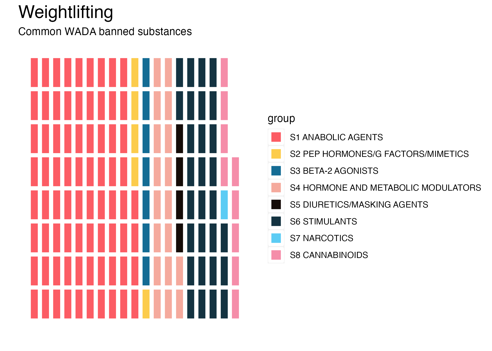

<!-- README.md is generated from README.Rmd. Please edit that file -->

# dopingdata

<!-- badges: start -->


<!-- https://img.shields.io/badge/lifecycle-stable-green.svg -->
<!-- badges: end -->

`dopingdata` contains data from the [United States Anti-Doping
Agency](https://en.wikipedia.org/wiki/United_States_Anti-Doping_Agency)
for exploration, modeling, and visualizations. The datasets in this
package are derived from from the [USADA
website](https://www.usada.org/) and the [World Anti-Doping Agency
(WADA) banned substances
list](https://www.wada-ama.org/en/prohibited-list?q=). Scraping,
processing, and visualizing these data presented so many unique
challenges I decided to combine the utilities into a package.

## Installation

You can install the development version of `dopingdata` like so:

``` r
# install.packages("devtools")
devtools::install_github("mjfrigaard/dopingdata")
```

``` r
library(dopingdata)
```



